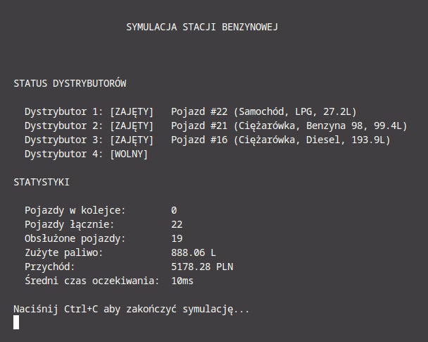
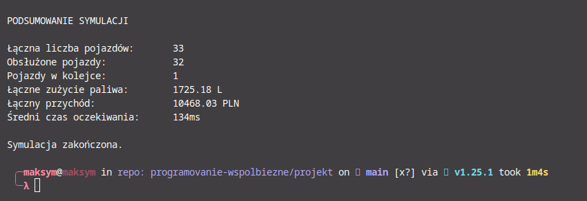

# Symulacja Stacji Benzynowej

## Opis projektu

Program symuluje działanie stacji benzynowej z wieloma dystrybutorami obsługującymi jednocześnie wiele pojazdów. Implementacja wykorzystuje współbieżność (goroutines) w języku Go do symulacji rzeczywistego scenariusza, w którym wiele jednostek działa niezależnie, ale korzysta ze wspólnych zasobów.

## Autorzy

Projekt wykonany na potrzeby kursu Programowanie Współbieżne.

## Wymagania

- Go 1.16 lub nowszy
- System operacyjny: Linux, macOS, Windows

## Instalacja i uruchomienie

```bash
cd projekt
go run main.go
```

## Architektura systemu

### Główne komponenty

1. **GasStation** - główna struktura reprezentująca stację benzynową
   - Zarządza dystrybutorami
   - Utrzymuje kolejkę pojazdów
   - Gromadzi statystyki
   - Koordynuje pracę wszystkich goroutines

2. **Pump** - reprezentuje dystrybutor paliwa
   - Każdy dystrybutor może obsługiwać wszystkie typy paliwa
   - Może obsługiwać tylko jeden pojazd jednocześnie
   - Chroniony mutexem przed równoczesnym dostępem

3. **Vehicle** - reprezentuje pojazd tankujący na stacji
   - Różne typy pojazdów (samochód, ciężarówka, motocykl)
   - Różne typy paliwa (Benzyna 95, 98, Diesel, LPG)
   - Różne ilości tankowanego paliwa

4. **Statistics** - zbiera statystyki działania stacji
   - Liczba obsłużonych pojazdów
   - Zużyte paliwo
   - Przychód
   - Średni czas oczekiwania

### Diagram architektury

```
┌─────────────────────────────────────────────────────────┐
│                    GasStation                           │
│                                                         │
│  ┌──────────┐  ┌──────────┐  ┌──────────┐            │
│  │  Pump 1  │  │  Pump 2  │  │  Pump 3  │  ...       │
│  │(goroutine│  │(goroutine│  │(goroutine│            │
│  └──────────┘  └──────────┘  └──────────┘            │
│        ▲              ▲              ▲                 │
│        │              │              │                 │
│        └──────────────┴──────────────┘                │
│                       │                                │
│              ┌────────▼────────┐                       │
│              │  Vehicle Queue  │                       │
│              │    (channel)    │                       │
│              └────────▲────────┘                       │
│                       │                                │
│            ┌──────────┴──────────┐                    │
│            │  Vehicle Generator  │                    │
│            │    (goroutine)      │                    │
│            └─────────────────────┘                    │
│                                                         │
│  ┌──────────────────┐  ┌──────────────────┐          │
│  │    Statistics    │  │   UI Display     │          │
│  │   Monitoring     │  │  (goroutine)     │          │
│  │  (goroutine)     │  └──────────────────┘          │
│  └──────────────────┘                                 │
└─────────────────────────────────────────────────────────┘
```

## Podział wątków (goroutines)

Program wykorzystuje następujące goroutines:

### 1. Goroutines dystrybutorów (runPump)
- **Liczba**: 4 (konfigurowalne)
- **Funkcja**: Obsługa pojazdów na dystrybutorze
- **Działanie**:
  - Czeka na pojazdy z kolejki (channel)
  - Zajmuje dystrybutor (ustawia IsOccupied = true)
  - Symuluje tankowanie (time.Sleep)
  - Aktualizuje statystyki
  - Zwalnia dystrybutor
- **Synchronizacja**: Mutex dla stanu dystrybutora, channel do pobierania pojazdów

### 2. Goroutine generatora pojazdów
- **Liczba**: 1
- **Funkcja**: Generowanie nowych pojazdów przybywających na stację
- **Działanie**:
  - Generuje losowe pojazdy co 1-3 sekundy
  - Dodaje pojazdy do kolejki
  - Inkrementuje licznik pojazdów
- **Synchronizacja**: Channel do wysyłania pojazdów, mutex dla liczników

### 3. Goroutine monitorowania statystyk (monitorStatistics)
- **Liczba**: 1
- **Funkcja**: Okresowe logowanie statystyk
- **Działanie**:
  - Co 5 sekund sprawdza statystyki
  - Potencjalne miejsce na rozszerzenie (zapis do pliku, alerty)
- **Synchronizacja**: RWMutex dla odczytu statystyk

### 4. Goroutine interfejsu użytkownika (displayUI)
- **Liczba**: 1
- **Funkcja**: Wyświetlanie stanu systemu w czasie rzeczywistym
- **Działanie**:
  - Co 500ms odświeża ekran
  - Wyświetla status dystrybutorów
  - Pokazuje statystyki
  - Informuje o kolejce
- **Synchronizacja**: RWMutex dla odczytu danych, mutex dla dystrybutorów

### 5. Główna goroutine (main)
- **Funkcja**: Koordynacja całego systemu
- **Działanie**:
  - Inicjalizacja stacji
  - Start wszystkich goroutines
  - Obsługa zakończenia programu
  - Wyświetlenie końcowych statystyk

## Użyte mechanizmy synchronizacji

### 1. Mutex (sync.Mutex)
**Lokalizacja**: `Pump.mutex`

**Cel**: Ochrona stanu dystrybutora przed równoczesnym dostępem

**Użycie**:
```go
pump.mutex.Lock()
pump.IsOccupied = true
pump.CurrentVehicle = vehicle
pump.mutex.Unlock()
```

**Dlaczego**: Zapobiega sytuacji, w której dwa wątki próbują jednocześnie użyć tego samego dystrybutora (race condition).

### 2. RWMutex (sync.RWMutex)
**Lokalizacja**: `Statistics.mutex`, `GasStation.mutex`

**Cel**: Ochrona danych z możliwością wielu czytelników lub jednego pisarza

**Użycie**:
```go
// Odczyt (wielu czytelników)
stats.mutex.RLock()
value := stats.TotalVehicles
stats.mutex.RUnlock()

// Zapis (tylko jeden pisarz)
stats.mutex.Lock()
stats.TotalVehicles++
stats.mutex.Unlock()
```

**Dlaczego**: Pozwala na efektywny odczyt przez wiele goroutines (UI, monitor) podczas gdy tylko jedna goroutine może pisać.

### 3. Channel (chan *Vehicle)
**Lokalizacja**: `GasStation.Queue`

**Cel**: Bezpieczna komunikacja między goroutines (producent-konsument)

**Użycie**:
```go
// Producent (generator pojazdów)
gs.Queue <- vehicle

// Konsument (dystrybutor)
vehicle := <-gs.Queue
```

**Dlaczego**: Channel w Go jest thread-safe i zapewnia bezpieczną komunikację. Implementuje wzorzec kolejki producentów-konsumentów.

### 4. WaitGroup (sync.WaitGroup)
**Lokalizacja**: `GasStation.pumpWg`

**Cel**: Synchronizacja zakończenia wszystkich dystrybutorów

**Użycie**:
```go
// Przed startem goroutine
gs.pumpWg.Add(1)

// W goroutine
defer gs.pumpWg.Done()

// Przy zakończeniu
gs.pumpWg.Wait()
```

**Dlaczego**: Zapewnia, że główna funkcja poczeka na zakończenie wszystkich dystrybutorów przed zamknięciem programu.

## Możliwe problemy współbieżności i ich rozwiązania

### 1. Race Condition na dystrybutorze
**Problem**: Dwa wątki próbują jednocześnie użyć tego samego dystrybutora.

**Rozwiązanie**: Mutex chroni stan dystrybutora (IsOccupied, CurrentVehicle).

### 2. Race Condition w statystykach
**Problem**: Wiele wątków jednocześnie modyfikuje statystyki.

**Rozwiązanie**: RWMutex chroni dostęp do statystyk. Wiele wątków może czytać, ale tylko jeden może pisać.

### 3. Deadlock
**Problem**: Niewłaściwa kolejność blokowania mutexów może prowadzić do deadlocka.

**Rozwiązanie**:
- Każdy mutex jest blokowany na krótki czas
- Nie ma zagnieżdżonych locków
- Używamy defer do automatycznego odblokowania

### 4. Goroutine leak
**Problem**: Goroutines mogą działać w nieskończoność jeśli nie zostaną właściwie zatrzymane.

**Rozwiązanie**:
- Flaga `Running` kontrolowana przez RWMutex
- Wszystkie pętle sprawdzają status Running
- WaitGroup zapewnia czystą synchronizację przy zakończeniu

## Interfejs użytkownika

Program wyświetla w czasie rzeczywistym:

1. **Status dystrybutorów** - czy są zajęte i jaki pojazd obsługują
2. **Statystyki**:
   - Pojazdy w kolejce
   - Pojazdy łącznie
   - Obsłużone pojazdy
   - Zużyte paliwo (litry)
   - Przychód (PLN)
   - Średni czas oczekiwania

Interfejs odświeża się co 500ms, dając użytkownikowi widok na działanie systemu w czasie rzeczywistym.

## Wyniki działania programu

### Widok podczas symulacji



### Podsumowanie po zakończeniu



## Konfiguracja

Parametry, które można łatwo zmienić:

- **Liczba dystrybutorów**: `NewGasStation(4)` - zmień liczbę na większą/mniejszą
- **Czas symulacji**: `time.Sleep(60 * time.Second)` - zmień na dłuższy/krótszy
- **Częstotliwość pojazdów**: `1000+rand.Intn(2000)` ms - zmień zakres
- **Ceny paliwa**: mapa `fuelPrices`
- **Rozmiar kolejki**: `make(chan *Vehicle, 50)` - zmień bufor kanału

## Przykładowe rozszerzenia

1. **Priorytetyzacja pojazdów** - pojazdy serwisowe z wyższym priorytetem
2. **Różne typy dystrybutorów** - niektóre obsługują tylko wybrane paliwa
3. **Systemy płatności** - symulacja różnych metod płatności
4. **Obsługa awarii** - losowe awarie dystrybutorów
5. **Optymalizacja kolejki** - algorytmy przydzielania pojazdów do dystrybutorów
6. **Zapis statystyk do pliku** - logowanie do CSV/JSON
7. **Interfejs webowy** - wyświetlanie stanu przez przeglądarkę
8. **Metryki wydajności** - pomiar throughput, utilization

## Wnioski

Program demonstruje praktyczne zastosowanie współbieżności w Go:

1. **Naturalna współbieżność** - każdy dystrybutor pracuje niezależnie
2. **Bezpieczna synchronizacja** - właściwe użycie mutexów i channels
3. **Skalowalność** - łatwo dodać więcej dystrybutorów
4. **Czytelność** - goroutines sprawiają, że kod jest naturalny i zrozumiały
5. **Wydajność** - współbieżność przyspiesza obsługę wielu pojazdów

## Testowanie

Program można przetestować poprzez:

1. **Obserwację statystyk** - wszystkie liczniki powinny się zgadzać
2. **Weryfikację synchronizacji** - żaden dystrybutor nie obsługuje dwóch pojazdów jednocześnie
3. **Test obciążenia** - zwiększenie częstotliwości pojazdów
4. **Test długotrwały** - uruchomienie na dłuższy czas bez wycieków pamięci

## Licencja

Projekt edukacyjny - wolne użytkowanie.
